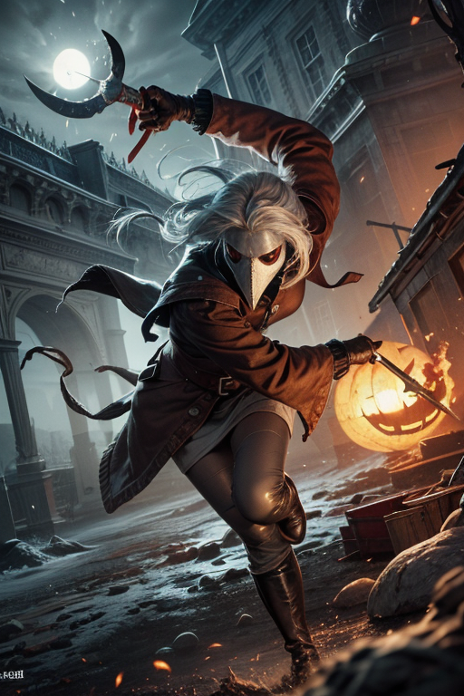
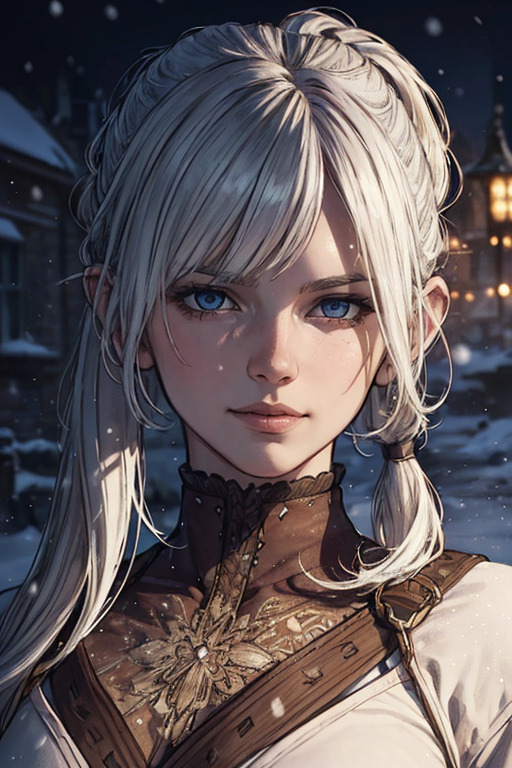
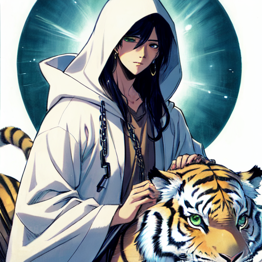
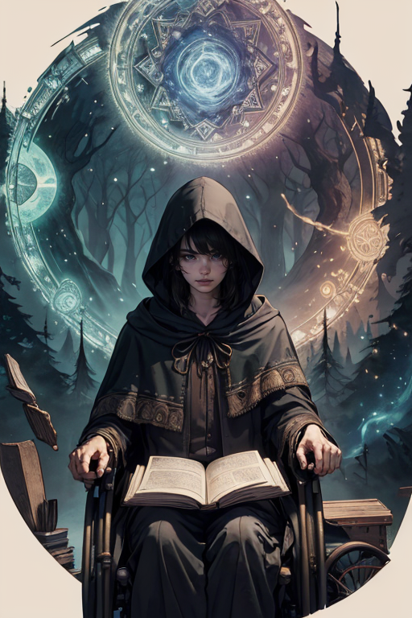

# Stable Diffusion Configuration

[Automatic1111](https://github.com/AUTOMATIC1111/stable-diffusion-webui) version **1.3.2**

## Extensions

 | Extension | URL | Branch | Commit | Date |
 | ---  | ---  | ---  | ---  | --- 
 | a1111-sd-webui-lycoris | https://github.com/KohakuBlueleaf/a1111-sd-webui-lycoris. | git | main | 123d1da1 | Thu Jun 8 01:19:40 2023 | 
 | adetailer | https://github.com/Bing-su/adetailer.git | main | 76424252 | Mon Jun 5 05:32:16 2023 | 
 | sd-dynamic-prompts | https://github.com/adieyal/sd-dynamic-prompts.git | main | 45b21373 | Sat Jun 3 10:48:47 2023 | 
 | sd-dynamic-thresholding | https://github.com/mcmonkeyprojects/sd-dynamic-thresholding.git | master | f02cacfc | Mon May 22 14:20:30 2023 | 
 | sd-webui-aspect-ratio-helper | https://github.com/thomasasfk/sd-webui-aspect-ratio-helper.git | main | 99fcf9b0 | Sun Jun 4 15:39:07 2023 | 
 | sd-webui-controlnet | https://github.com/Mikubill/sd-webui-controlnet.git | main | 05e66969 | Fri Jun 9 05:50:02 2023 | 
 | stable-diffusion-webui-images-browser | https://github.com/AlUlkesh/stable-diffusion-webui-images-browser.git | main | b2f6e4cb | Thu Jun 8 08:11:43 2023 | 
 | stable-diffusion-webui-wildcards | https://github.com/AUTOMATIC1111/stable-diffusion-webui-wildcards | master | 6ed81ed1 | Sat Oct 29 16:18:48 2022 | 
 | LDSR |  |  |  | 
 | Lora |  |  |  | 
 | ScuNET |  |  |  | 
 | SwinIR |  |  |  | 
 | prompt-bracket-checker |  |  |  | 

## [Textual Inversions](https://github.com/civitai/civitai/wiki/How-to-use-models#textual-inversions)

### Used

* [verybadimagenegative_v1.3](https://civitai.com/models/11772?modelVersionId=25820)
* [ng_deepnegative_v1_75t](https://civitai.com/models/4629?modelVersionId=5637)
* [HorrorFantasy](https://civitai.com/models/82239?modelVersionId=87325)
* [EasyNegative](https://civitai.com/models/7808/easynegative)
* [bad-hands-5](https://huggingface.co/yesyeahvh/bad-hands-5/tree/main)
* [bad-artist-anime](https://huggingface.co/nick-x-hacker/bad-artist)
* [bad-artist](https://huggingface.co/nick-x-hacker/bad-artist)
* [aurate](https://civitai.com/models/4941/au-ra-xaela-final-fantasy-xiv)
* [style-swirlmagic](https://civitai.com/models/25829/style-swirl-magic)
* [style-rustmagic](https://civitai.com/models/10764/style-rust-magic)
* [style-sylvamagic](https://civitai.com/models/7523/style-sylva-magic)
* [space_style](https://civitai.com/models/7278/space-style-ti)
* [DarkFantasy](https://civitai.com/models/30287/dark-fantasy-style)
* [Style-SwampMagic](https://civitai.com/models/54966/style-swamp-magic)

### To do: Need to incorporate

* [Amazing Embeddings - fcPortrait](https://civitai.com/models/81575?modelVersionId=86566)
* [Amazing Embeddings - fcDetailPortrait](https://civitai.com/models/81575?modelVersionId=91967)
* [Amazing Embeddings - fcHeatPortrait](https://civitai.com/models/81575?modelVersionId=91959)

## [Wildcards](https://github.com/AUTOMATIC1111/stable-diffusion-webui-wildcards)

The [wildcards](wildcards) folder can be copied into your `extensions/sd-dynamic-prompts/wildcards` folder.

* [Fantasy Prompt Generator](https://civitai.com/models/45448/full-feature-character-prompts-fantasy) - I had to make some tweaks to the default `full-prompt-fantasy.txt` file as some of the LoRA's referenced were actually LyCORIS files.
* `full-prompt-exalted.txt` is currently `full-prompt-fantasy.txt` minus entries that aren't particularly releveant to the Exalted setting. But I want to iterate on this file and make it our own.

## LoRAs and LyCORIS

### Used

* LoRA
  * [1001ArabianNightsV3](https://civitai.com/models/69315/1001arabiannights)
  * [1970RetroFuturism](https://civitai.com/models/64235/1970retrofuturism)
  * [AlchemyPunkAI](https://civitai.com/models/78766/alchemypunkai)
  * [AngelicAI](https://civitai.com/models/76229/angelicai)
  * [Antimatter - World Morph](https://civitai.com/models/59527/antimatter-world-morph)
  * [ArtDecoAI](https://civitai.com/models/37495/artdecoai)
  * [Atompunk (Rethinking)](https://civitai.com/models/65960/atompunk-rethinking)
  * [baroqueAI](https://civitai.com/models/38414/baroqueai)
  * [BiophyllTech](https://civitai.com/models/74430/biophyll-tech)
  * [BohoAI](https://civitai.com/models/51966/bohoai)
  * [bronzepunkai](https://civitai.com/models/29277/bronzepunkai)
  * [CnCGDIAIv2](https://civitai.com/models/81160?modelVersionId=86089)
  * [CnCNODAIv2](https://civitai.com/models/81160?modelVersionId=86094)
  * [ConstructionyardAIV3](https://civitai.com/models/53493/constructionyardai)
  * [CyberPunkAI](https://civitai.com/models/77121/neoncyberpunkai)
  * [Detail Tweaker LoRA (细节调整LoRA)](https://civitai.com/models/58390/detail-tweaker-lora-lora)
  * [Dra9onScaleAI](https://civitai.com/models/55543?modelVersionId=70189)
  * [DwemerTech](https://civitai.com/models/65028/dwemer-tech-world-morph)
  * [Fire_VFX](https://civitai.com/models/9049/firevfx-create-more-consistent-fire)
  * [FrostRaceTech](https://civitai.com/models/81485/frost-race-tech-world-morph)
  * [GasLightPunkAIv3](https://civitai.com/models/71335/gaslampfantasyai)
  * [GlassTech - World Morph](https://civitai.com/models/57933/glasstech-world-morph)
  * [GlowingRunesAIV3](https://civitai.com/models/51686/glowingrunesai)
  * [GothicHorrorAI](https://civitai.com/models/39760/gothichorrorai)
  * [GothicPunkAI](https://civitai.com/models/78695/gothicpunkai)
  * [GrecoRomaPunkAI](https://civitai.com/models/76190/grecoromapunkai)
  * [kVoidEnergy](https://civitai.com/models/60553/kvoidenergy)
  * [LightingVFX](https://civitai.com/models/10222/lightningvfx-create-more-consistent-lightning)
  * [MagmaTech](https://civitai.com/models/77252/magma-tech-world-morph)
  * [MahabharataPunkAI](https://civitai.com/models/71478/mahabharatapunkai)
  * [NeonPunk - 3D / neon style](https://civitai.com/models/55908/neonpunk-3d-neon-style)
  * [NodesTech](https://civitai.com/models/72451/nodes-tech-world-morph)
  * [postapocalypseAI](https://civitai.com/models/36848/postapocalypseai)
  * [RetroFuturismAI](https://civitai.com/models/43465/retrofuturismai)
  * [RootsBranchesAIv5](https://civitai.com/models/63660/rootsbranchesai)
  * [runemagic](https://civitai.com/models/66359?modelVersionId=71024)
  * [SamuraiPunkAIv3](https://civitai.com/models/69108/samuraipunkai)
  * [smoke_model](https://civitai.com/models/64241/smokeverse)
  * [SolarpunkAI](https://civitai.com/models/43944/solarpunkai)
  * [SovietPunkAIv2](https://civitai.com/models/75709/sovietpunkai)
  * [StonepunkAI](https://civitai.com/models/51539?modelVersionId=56015)
  * [TerranAIv2](https://civitai.com/models/61918/terranai)
  * [totempunkai_v20](https://civitai.com/models/71819/totempunk-redone)
  * [Unholy](https://civitai.com/models/76541/unholy)
  * [waterVFX](https://civitai.com/models/10750/watervfx-create-more-consistent-water-wip)
  * [Wheelchair](https://civitai.com/models/75307/wheelchair)
  * [WitchcraftPunkAI](https://civitai.com/models/78280/witchcraftpunkai)
* LyCORIS
  * [CulturePunkBundle](https://civitai.com/models/68253/culturepunkbundle)
  * [FiveDecorsAIx3](https://civitai.com/models/66366/decorationbundle)
  * [HorrorBundlev4](https://civitai.com/models/67344/horrorbundle)
  * [PunkBundleAI](https://civitai.com/models/65675/bigfivepunkai)

### To Do: Need to Incorporate

These are currently not used in any of my wildcards.

* [AetherPunkAI](https://civitai.com/models/85036/aetherpunkai)
* [IceAI](https://civitai.com/models/86440/iceai)

## Settings Tweaks

Changes from default Stable Diffusion settings.

* Stable Diffusion
  * Select Enable quantization in K samplers for sharper and cleaner results.
  * Clip Skip: `2`
* User interface
  * Quicksettings List
    * `sd_model_checkpoint sd_vae`

## VAE

* [vae-ft-mse-840000-ema-pruned](https://huggingface.co/stabilityai/sd-vae-ft-mse-original/blob/main/vae-ft-mse-840000-ema-pruned.ckpt)
* [kl-f8-anime2.ckpt](https://huggingface.co/hakurei/waifu-diffusion-v1-4/blob/main/vae/kl-f8-anime2.ckpt)

# Exalted Characters

## Template

* **Model:** [Name](URL)
  * **VAE:** `vae-ft-mse-840000-ema-pruned` or `kl-f8-anime2.ckpt` or `None`
  * **Dynamic Prompt:** `prompt`
  * **Negative Prompt:** `negative prompt`
  * **Other Metadata:** `metadata`

## Severnaya

* **Model:** [XXMix_4](https://civitai.com/models/47919/xxmix4)
  * **VAE:** vae-ft-mse-840000-ema-pruned
  * **Prompt:** `(masterpiece, top quality, best, official art, beautiful and aesthetic, long exposure:1.2), 1girl, stealthy, <lora:add_detail:0.75>, white hair, pony tail, brown clothes, combat pose,holding daggers, floating particles,ethereal dynamic,fluid movement,captivating patterns,(fractal art:1.3),luminous trails icy mountain, <lora:plague doctor:0.8> plague doctor, underworld, gloom, horror, thick outlines, strong shadows,muddy, frozen, blizzard, spooky, mystical sky:1.3, ghosts (style-rustmagic:1.0) solo, (full body:0.6), looking down, detailed background, detailed face, (<lora:CulturePunkBundle:0.5>, zulupunkai, zulu theme:1.1), rust-warrior, rusty armor, rusted iron, rusted metal, (rusty:1.05), red rust, weathered, corroded, grungy, fully rusted, machinery, dynamic pose, rust in background, dark lighting, cinematic atmosphere,`
  * **Dynamic Prompt:** `(masterpiece, top quality, best, official art, beautiful and aesthetic, long exposure:1.2), 1girl, {<lora:add_detail:0.75>|}, {0-2$$stealthy|assassin}, white hair, pony tail, brown clothes, {combat pose,holding daggers|sneaking|gambler}, {0-8$$floating particles|ethereal dynamic|luminous trails|vibrant colors|(fractal art:1.3)|extreme detailed|fluid movement|captivating patterns} {Illustrate a snow-covered medieval town landscape|ethereal atmosphere|icy mountain}, {smirk|smile|angry|<lora:plague doctor:0.8> plague doctor, underworld, gloom, horror, thick outlines, strong shadows,muddy, frozen, blizzard, spooky, mystical sky:1.3, ghosts } __full-prompt-fantasy__`
  * **Negative Prompt:** `ng_deepnegative_v1_75t, badhandv4, (worst quality:2), (low quality:2), (normal quality:2), lowres, bad anatomy, bad hands, normal quality, (monochrome, grayscale)`
  * **Other Metadata:** `Steps: 25, Sampler: DPM++ 2M Karras, CFG scale: 20, Seed: 2517177978, Size: 512x768, Model hash: 261db084d3, Model: xxmix4_v10, Clip skip: 2, ADetailer model: face_yolov8n.pt, ADetailer confidence: 0.3, ADetailer dilate/erode: 4, ADetailer mask blur: 4, ADetailer denoising strength: 0.4, ADetailer inpaint only masked: True, ADetailer inpaint padding: 32, ADetailer model 2nd: hand_yolov8n.pt, ADetailer confidence 2nd: 0.3, ADetailer dilate/erode 2nd: 4, ADetailer mask blur 2nd: 4, ADetailer denoising strength 2nd: 0.4, ADetailer inpaint only masked 2nd: True, ADetailer inpaint padding 2nd: 32, ADetailer version: 23.6.2, Lora hashes: "add_detail: 7c6bad76eb54, plague doctor: 03edb8750c9e, CulturePunkBundle: 8a0f0072fcc6", Dynamic thresholding enabled: True, Mimic scale: 7, Threshold percentile: 100, Mimic mode: Half Cosine Up, Mimic scale minimum: 5, CFG mode: Half Cosine Up, CFG scale minimum: 5, Version: v1.3.2`

* **Model:** [BrickAndMortarMix](https://civitai.com/models/83867?modelVersionId=89141)
  * **VAE:** `vae-ft-mse-840000-ema-pruned`
  * **Dynamic Prompt:** `(best quality, masterpiece:1.2), photorealistic, thick outlines, strong shadows, <lora:add_detail:0.75>, 1girl, detailed background, detailed face, stealthy, assassin, white hair, pony tail, brown clothes, dramatic lighting, {combat pose,holding daggers|sneaking|gambler}, {Illustrate a snow-covered medieval town landscape|ethereal atmosphere|icy mountain}, glowing aura, {smirk|smile|angry|<lora:plague doctor:0.8> plague doctor, underworld, gloom, horror, thick outlines, strong shadows,muddy, frozen, blizzard, spooky, mystical sky:1.3, ghosts } __full-prompt-fantasy__`
  * **Negative Prompt:** `(worst quality, low quality:1.4), logo, watermark, signature, text, EasyNegative, (verybadimagenegative_v1.3:0.75), armor`
  * **Other Metadata:** `Steps: 25, Sampler: DPM++ 2M Karras, CFG scale: 20, Size: 512x768, Model hash: 4e2802c6f9, Model: brickandmortarmix_v10, Clip skip: 2, ADetailer model: face_yolov8n.pt, ADetailer confidence: 0.3, ADetailer dilate/erode: 4, ADetailer mask blur: 4, ADetailer denoising strength: 0.4, ADetailer inpaint only masked: True, ADetailer inpaint padding: 32, ADetailer model 2nd: hand_yolov8n.pt, ADetailer confidence 2nd: 0.3, ADetailer dilate/erode 2nd: 4, ADetailer mask blur 2nd: 4, ADetailer denoising strength 2nd: 0.4, ADetailer inpaint only masked 2nd: True, ADetailer inpaint padding 2nd: 32, ADetailer version: 23.6.2, Lora hashes: "add_detail: 7c6bad76eb54, plague doctor: 03edb8750c9e", Dynamic thresholding enabled: True, Mimic scale: 7, Threshold percentile: 100, Mimic mode: Half Cosine Up, Mimic scale minimum: 5, CFG mode: Half Cosine Up, CFG scale minimum: 5, Version: v1.3.2`

## Kevik

* **Model:** [BreakDomain](https://civitai.com/models/50520/breakdomain)
  * **VAE:** `vae-ft-mse-840000-ema-pruned`
  * **Prompt:** `a man with a white robe, Ayami Kojima, yukito kishiro, a manga drawing, fantasy art, 1boy, black_hair, long_hair, chain, earrings, green_eyes, hood, hood_up, hooded_cloak, jewelry, magic_circle, male_focus, simple_background, solo, upper_body, riding a tiger`
  * **Other Metadata:** `Steps: 30, Sampler: DPM++ SDE Karras, CFG scale: 7, Seed: 2645047581, Size: 512x512, Model hash: 0805b136eb, Model: breakdomain_M2150, Clip skip: 2, Version: v1.2.1`

## Obscuria

* **Model:** [BrickAndMortarMix](https://civitai.com/models/83867?modelVersionId=89141)
  * **VAE:** `vae-ft-mse-840000-ema-pruned`
  * **Dynamic Prompt:** `(best quality, masterpiece:1.2), photorealistic, , detailed face,strong shadows, 1girl, petite, black hair, brown cloak, hood, hooded face, mysterious, , thick forest, dramatic landscape, sitting in wooden wheelchair <lora:wheelchair:1>, __full-prompt-fantasy__`
  * **Prompt:** `(best quality, masterpiece:1.2), photorealistic, , detailed face,strong shadows, 1girl, petite, black hair, brown cloak, hood, hooded face, mysterious, , thick forest, dramatic landscape, sitting in wooden wheelchair <lora:wheelchair:1>, solo, half shot, looking at viewer, detailed background, detailed face, intricate details, (<lora:runemagic:0.4>, magic_circle, Rune_Magic theme:1.1) scribe sitting at desk, reading, clutter, surrounded by maps, notes, swirling magical symbols, abacus, cryptic device, formulas, floating magical symbols, magic emerging from text, (style-swirlmagic:1.0), ancient magic, knowledge, discovery, thought, archive in background, ethereal atmosphere,`
  * **Negative Prompt:** `(worst quality, low quality:1.4), logo, watermark, signature, text, EasyNegative, (verybadimagenegative_v1.3:0.75), armor`
  * **Other Metadata:** `Steps: 25, Sampler: DPM++ 2M Karras, CFG scale: 20, Seed: 3120035073, Size: 512x768, Model hash: 4e2802c6f9, Model: brickandmortarmix_v10, Clip skip: 2, ADetailer model: face_yolov8n.pt, ADetailer confidence: 0.3, ADetailer dilate/erode: 4, ADetailer mask blur: 4, ADetailer denoising strength: 0.4, ADetailer inpaint only masked: True, ADetailer inpaint padding: 32, ADetailer model 2nd: hand_yolov8n.pt, ADetailer confidence 2nd: 0.3, ADetailer dilate/erode 2nd: 4, ADetailer mask blur 2nd: 4, ADetailer denoising strength 2nd: 0.4, ADetailer inpaint only masked 2nd: True, ADetailer inpaint padding 2nd: 32, ADetailer version: 23.6.2, Lora hashes: "wheelchair: f18e03f6ae0a, runemagic: c53f1b29a1f1", Dynamic thresholding enabled: True, Mimic scale: 7, Threshold percentile: 100, Mimic mode: Half Cosine Up, Mimic scale minimum: 5, CFG mode: Half Cosine Up, CFG scale minimum: 5, Version: v1.3.2`

## Simon

* **Model:** [Name](URL)
  * **VAE:** `vae-ft-mse-840000-ema-pruned` or `kl-f8-anime2.ckpt` or `None`
  * **Dynamic Prompt:** `prompt`
  * **Negative Prompt:** `negative prompt`
  * **Other Metadata:** `metadata`