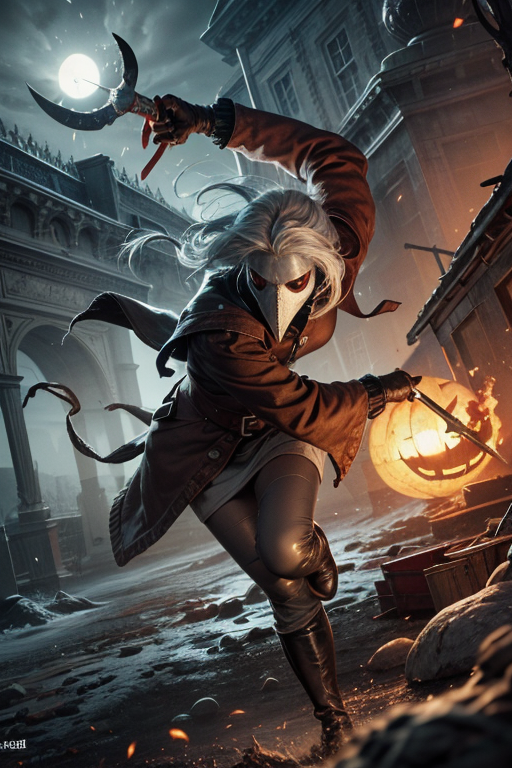
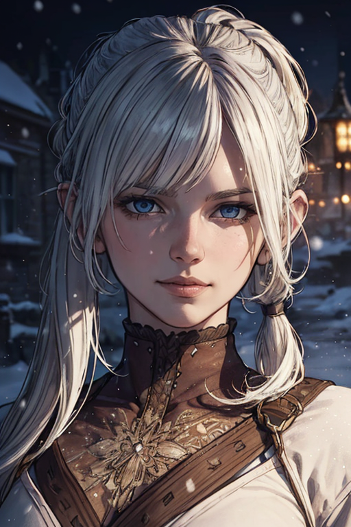

# Stable Diffusion Configuration

[Automatic1111](https://github.com/AUTOMATIC1111/stable-diffusion-webui) version **1.3.2**

## Extensions

 | Extension | URL | Branch | Commit | Date |
 | ---  | ---  | ---  | ---  | --- 
 | a1111-sd-webui-lycoris | https://github.com/KohakuBlueleaf/a1111-sd-webui-lycoris. | git | main | 123d1da1 | Thu Jun 8 01:19:40 2023 | 
 | adetailer | https://github.com/Bing-su/adetailer.git | main | 76424252 | Mon Jun 5 05:32:16 2023 | 
 | sd-dynamic-prompts | https://github.com/adieyal/sd-dynamic-prompts.git | main | 45b21373 | Sat Jun 3 10:48:47 2023 | 
 | sd-dynamic-thresholding | https://github.com/mcmonkeyprojects/sd-dynamic-thresholding.git | master | f02cacfc | Mon May 22 14:20:30 2023 | 
 | sd-webui-aspect-ratio-helper | https://github.com/thomasasfk/sd-webui-aspect-ratio-helper.git | main | 99fcf9b0 | Sun Jun 4 15:39:07 2023 | 
 | sd-webui-controlnet | https://github.com/Mikubill/sd-webui-controlnet.git | main | 05e66969 | Fri Jun 9 05:50:02 2023 | 
 | stable-diffusion-webui-images-browser | https://github.com/AlUlkesh/stable-diffusion-webui-images-browser.git | main | b2f6e4cb | Thu Jun 8 08:11:43 2023 | 
 | stable-diffusion-webui-wildcards | https://github.com/AUTOMATIC1111/stable-diffusion-webui-wildcards | master | 6ed81ed1 | Sat Oct 29 16:18:48 2022 | 
 | LDSR |  |  |  | 
 | Lora |  |  |  | 
 | ScuNET |  |  |  | 
 | SwinIR |  |  |  | 
 | prompt-bracket-checker |  |  |  | 

## [Textual Inversions](https://github.com/civitai/civitai/wiki/How-to-use-models#textual-inversions)

* [verybadimagenegative_v1.3](https://civitai.com/models/11772?modelVersionId=25820)
* [ng_deepnegative_v1_75t](https://civitai.com/models/4629?modelVersionId=5637)
* [HorrorFantasy](https://civitai.com/models/82239?modelVersionId=87325)
* [EasyNegative](https://civitai.com/models/7808/easynegative)
* [bad-hands-5](https://huggingface.co/yesyeahvh/bad-hands-5/tree/main)
* [bad-artist-anime](https://huggingface.co/nick-x-hacker/bad-artist)
* [bad-artist](https://huggingface.co/nick-x-hacker/bad-artist)
* [aurate](https://civitai.com/models/4941/au-ra-xaela-final-fantasy-xiv)

## [Wildcards](https://github.com/AUTOMATIC1111/stable-diffusion-webui-wildcards)

[Fantasy Prompt Generator](https://civitai.com/models/45448/full-feature-character-prompts-fantasy) - I had to make some tweaks/bug fixes which I will document later.

## Settings Tweaks

Changes from default Stable Diffusion settings.

* Stable Diffusion
  * Select Enable quantization in K samplers for sharper and cleaner results.
  * Clip Skip: `2`
* User interface
  * Quicksettings List
    * `sd_model_checkpoint sd_vae`

## VAE

* [vae-ft-mse-840000-ema-pruned](https://huggingface.co/stabilityai/sd-vae-ft-mse-original/blob/main/vae-ft-mse-840000-ema-pruned.ckpt)
* [kl-f8-anime2.ckpt](https://huggingface.co/hakurei/waifu-diffusion-v1-4/blob/main/vae/kl-f8-anime2.ckpt)

# Exalted Characters

## Template

* **Model:** [Name](URL)
  * **VAE:** `vae-ft-mse-840000-ema-pruned` or `kl-f8-anime2.ckpt` or `None`
  * **Dynamic Prompt:** `prompt`
  * **Negative Prompt:** `negative prompt`
  * **Other Metadata:** `metadata`

## Severnaya

* **Model:** [XXMix_4](https://civitai.com/models/47919/xxmix4)
  * **VAE:** vae-ft-mse-840000-ema-pruned
  * **Dynamic Prompt:** `(masterpiece, top quality, best, official art, beautiful and aesthetic, long exposure:1.2), 1girl, {<lora:add_detail:0.75>|}, {0-2$$stealthy|assassin}, white hair, pony tail, brown clothes, {combat pose,holding daggers|sneaking|gambler}, {0-8$$floating particles|ethereal dynamic|luminous trails|vibrant colors|(fractal art:1.3)|extreme detailed|fluid movement|captivating patterns} {Illustrate a snow-covered medieval town landscape|ethereal atmosphere|icy mountain}, {smirk|smile|angry|<lora:plague doctor:0.8> plague doctor, underworld, gloom, horror, thick outlines, strong shadows,muddy, frozen, blizzard, spooky, mystical sky:1.3, ghosts } __full-prompt-fantasy__`
  * **Negative Prompt:** `ng_deepnegative_v1_75t, badhandv4, (worst quality:2), (low quality:2), (normal quality:2), lowres, bad anatomy, bad hands, normal quality, (monochrome, grayscale)`
  * **Other Metadata:** `Steps: 25, Sampler: DPM++ 2M Karras, CFG scale: 20,  Size: 512x768, Model hash: 261db084d3, Model: xxmix4_v10, Clip skip: 2, ADetailer model: face_yolov8n.pt, ADetailer confidence: 0.3, ADetailer dilate/erode: 4, ADetailer mask blur: 4, ADetailer denoising strength: 0.4, ADetailer inpaint only masked: True, ADetailer inpaint padding: 32, ADetailer model 2nd: hand_yolov8n.pt, ADetailer confidence 2nd: 0.3, ADetailer dilate/erode 2nd: 4, ADetailer mask blur 2nd: 4, ADetailer denoising strength 2nd: 0.4, ADetailer inpaint only masked 2nd: True, ADetailer inpaint padding 2nd: 32, ADetailer version: 23.6.2, Lora hashes: "add_detail: 7c6bad76eb54, plague doctor: 03edb8750c9e", Dynamic thresholding enabled: True, Mimic scale: 7, Threshold percentile: 100, Mimic mode: Half Cosine Up, Mimic scale minimum: 5, CFG mode: Half Cosine Up, CFG scale minimum: 5, Version: v1.3.2`

* **Model:** [BrickAndMortarMix](https://civitai.com/models/83867?modelVersionId=89141)
  * **VAE:** `vae-ft-mse-840000-ema-pruned`
  * **Dynamic Prompt:** `(best quality, masterpiece:1.2), photorealistic, thick outlines, strong shadows, <lora:add_detail:0.75>, 1 girl, adult (elven:0.7) woman, 1girl, detailed background, detailed face, stealthy, assassin, white hair, pony tail, brown clothes, dramatic lighting, {combat pose,holding daggers|sneaking|gambler}, {Illustrate a snow-covered medieval town landscape|ethereal atmosphere|icy mountain}, glowing aura, {smirk|smile|angry|<lora:plague doctor:0.8> plague doctor, underworld, gloom, horror, thick outlines, strong shadows,muddy, frozen, blizzard, spooky, mystical sky:1.3, ghosts } __full-prompt-fantasy__`
  * **Negative Prompt:** `(worst quality, low quality:1.4), logo, watermark, signature, text, EasyNegative, (verybadimagenegative_v1.3:0.75), armor`
  * **Other Metadata:** `Steps: 25, Sampler: DPM++ 2M Karras, CFG scale: 20, Size: 512x768, Model hash: 4e2802c6f9, Model: brickandmortarmix_v10, Clip skip: 2, ADetailer model: face_yolov8n.pt, ADetailer confidence: 0.3, ADetailer dilate/erode: 4, ADetailer mask blur: 4, ADetailer denoising strength: 0.4, ADetailer inpaint only masked: True, ADetailer inpaint padding: 32, ADetailer model 2nd: hand_yolov8n.pt, ADetailer confidence 2nd: 0.3, ADetailer dilate/erode 2nd: 4, ADetailer mask blur 2nd: 4, ADetailer denoising strength 2nd: 0.4, ADetailer inpaint only masked 2nd: True, ADetailer inpaint padding 2nd: 32, ADetailer version: 23.6.2, Lora hashes: "add_detail: 7c6bad76eb54, plague doctor: 03edb8750c9e", Dynamic thresholding enabled: True, Mimic scale: 7, Threshold percentile: 100, Mimic mode: Half Cosine Up, Mimic scale minimum: 5, CFG mode: Half Cosine Up, CFG scale minimum: 5, Version: v1.3.2`

## Kevik

* **Model:** [Name](URL)
  * **VAE:** `vae-ft-mse-840000-ema-pruned` or `kl-f8-anime2.ckpt` or `None`
  * **Dynamic Prompt:** `prompt`
  * **Negative Prompt:** `negative prompt`
  * **Other Metadata:** `metadata`

## Obscuria

* **Model:** [Name](URL)
  * **VAE:** `vae-ft-mse-840000-ema-pruned` or `kl-f8-anime2.ckpt` or `None`
  * **Dynamic Prompt:** `prompt`
  * **Negative Prompt:** `negative prompt`
  * **Other Metadata:** `metadata`

## Simon

* **Model:** [Name](URL)
  * **VAE:** `vae-ft-mse-840000-ema-pruned` or `kl-f8-anime2.ckpt` or `None`
  * **Dynamic Prompt:** `prompt`
  * **Negative Prompt:** `negative prompt`
  * **Other Metadata:** `metadata`